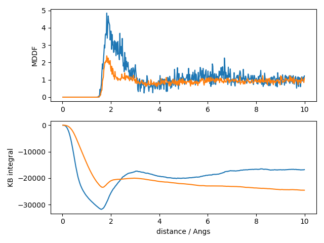
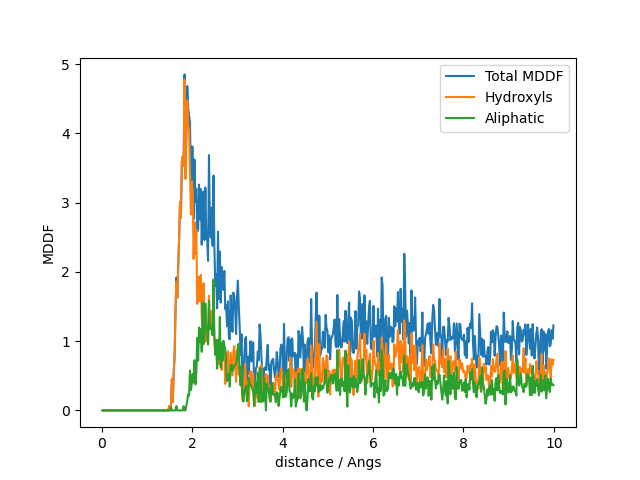

# [From Python](@id python)

!!! note
    Most features of the package are available through this Python interface. However, some flexibility may be reduced and, also, the tunning of the plot appearance is left to the user, as it is expected that he/she is fluent with some tools within Python if choosing this interface.

    Python 3 or greater is required.

    Please report issues, incompatibilities, or any other difficulty in using the package and its interface.
    
The following examples consider a system composed a protein solvated by a mixture of water and glycerol, built with [Packmol](http://m3g.iqm.unicamp.br/packmol). The simulations were performed with [NAMD](https://www.ks.uiuc.edu/Research/namd/) with periodic boundary conditions and a NPT ensemble at room temperature and pressure. Molecular pictures were produced with [VMD](https://www.ks.uiuc.edu/Research/vmd/).

```@raw html
<center>

</center>
```

Image of the system of the example: a protein solvated by a mixture of glycerol (green) and water, at a concentration of 50%vv.

## Loading the `ComplexMixtures.py` file

The Python interface of `ComplexMixtures` is implemented in the [`ComplexMixtures.py`](./assets/ComplexMixtures.py) file. 
Just download it from the link and save it in a known path.

## Installing `juliacall`

[`juliacall`](https://github.com/cjdoris/PythonCall.jl) is a package that allows calling Julia programs from Python. Install it with

```bash
pip install juliacall
```

## Installing Julia and underlying packages

Once `juliacall` is installed, from within Python, execute:
```python
import ComplexMixtures
```
here we assume that the [`ComplexMixtures.py`](./assets/ComplexMixtures.py) file is in the same directory where you launched Python.

!!! note 
     **On the first** time you execute this command, the Julia executable and the required Julia packages (`ComplexMixtures` and `PDBTools`) will be downloaded and installed. At the end of the process quit Python (not really required, but we prefer to separate the installation from the use of the module). 

## Example

### Index

- [Data, packages, and execution](@ref data-pythonexample)
- [Minimum-Distance Distribution function](@ref script1-python)
- [MDDF and KB integrals](@ref python-plotting1)
- [Atomic contributions to the MDDF](@ref python-plotting2)

### [Data, packages, and execution](@id data-pythonexample)

The files required to run this example are:

- [system.pdb](https://raw.githubusercontent.com/m3g/ComplexMixturesExamples/main/Protein_in_Glycerol/Data/system.pdb): The PDB file of the complete system.
- [glyc50_sample.dcd](https://www.dropbox.com/scl/fi/n3gtyotavo00jtz8bajti/glyc50_sample.dcd?rlkey=5ax8t4w7e0dr5w0n5g797p02j&dl=0): A 30Mb sample trajectory file. The [full trajectory](https://www.dropbox.com/scl/fi/zfq4o21dkttobg2pqd41m/glyc50_traj.dcd?rlkey=el3k6t0fx6w5yiqktyx96gzg6&dl=0) can also be used, but it is a 1GB file.

To start, create a directory and copy the [`ComplexMixtures.py`](./assets/ComplexMixtures.py) file to it. Navigate into this directory, and, to start, set the number of threads that Julia will use, to run the calculations in parallel. Typically, in `bash`, this means defining teh following environment variable:
```bash
export JULIA_NUM_THREADS=8
```
where `8` is the number of CPU cores available in your computer. For further information about Julia multi-threading, and on setting this environment variable in other systems, please read [this section](https://docs.julialang.org/en/v1/manual/multi-threading/#Starting-Julia-with-multiple-threads) of the Julia manual.

Finally, each script can be executed with, for example:
```bash
python3 script.py
```

### [Minimum-Distance Distribution function](@id script1-python)

```@raw html
<details><summary><font color="darkgreen">Complete example code: click here!</font></summary>
```
```@eval
using Markdown
code = Markdown.parse("""
\`\`\`python
$(read("./assets/scripts/python/script1.py", String))
\`\`\`
""")
```
```@raw html
</details><br>
```

Note that the example here follows an identical syntax to the Julia example, except that we qualify the name of the loaded module and implicitly load the `PDBTools` package.

The script to compute the MDDFs as associated data from within python is, then:

!!! note
    To change the options of the calculation, set the `Options` structure accordingly and pass it as a parameter to `mddf`. For example:
    ```python
    options = cm.Options(bulk_range=(8.0, 12.0))
    results = cm.mddf(trajectory, options)
    ```
    The complete set of options available is described [here](@ref options).


The trajectory that was loaded was for a toy-example. The complete trajectory is available [here](https://drive.google.com/file/d/14M30jDHRwUM77hzbDphgbu8mcWFBcQrX/view?usp=sharing), but it is a 3GB file. The same procedure above was performed with that file and produced the `results_Glyc50.json` file, which is available in the Data directory here. We will continue with this file instead. 

### [MDDF and KB integrals](@id python-plotting1)

The following python script will produce the typical MDDF and KB integral plot, for the sample system.
The noise in the figures is because the trajectory sample is small.

```@raw html
<details><summary><font color="darkgreen">Complete example code: click here!</font></summary>
```
```@eval
using Markdown
code = Markdown.parse("""
\`\`\`python
$(read("./assets/scripts/python/script2.py", String))
\`\`\`
""")
```
```@raw html
</details><br>
```



In the top plot, we see that glycerol and water display clear solvation shells around the protein,
with glycerol having a greater peak. This accumulation leads to a greater (less negative) KB integral for glycerol than water, as shown in the second plot. This indicates that the protein is preferentially solvated by glycerol in this system (assuming that sampling is adequate in this small
trajectory).

### [Atomic contributions to the MDDF](@id python-plotting2)

The following script produces a plot of the group contributions of Glycerol to the total MDDF function. The Glycerol MDDF is split into the contributions of the hydroxyl and aliphatic groups.

```@raw html
<details><summary><font color="darkgreen">Complete example code: click here!</font></summary>
```
```@eval
using Markdown
code = Markdown.parse("""
\`\`\`python
$(read("./assets/scripts/python/script3.py", String))
\`\`\`
""")
```
```@raw html
</details><br>
```



Despite the low sampling, it is clear that hydroxyl groups contribute to the greter peak of the distribution, at hydrogen-bonding distances, as expected. The contributions of the aliphatic groups to the MDDF occurs at longer distances, associated to non-specific interactions. 

!!! note
    The syntax here diverges from the Julia-only examples by requiring the lists of names
    to be converted to Julia arrays, which happens by using the `cm.list(python_list)` function calls.